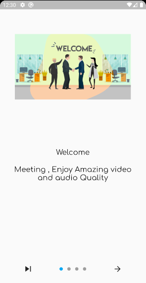
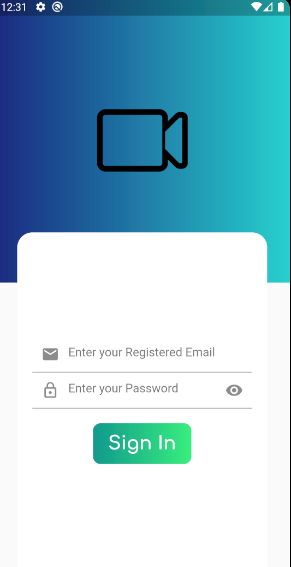
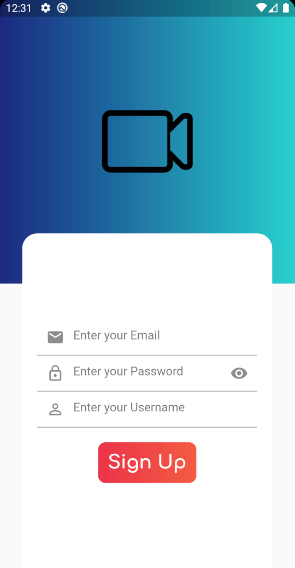
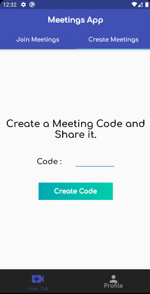
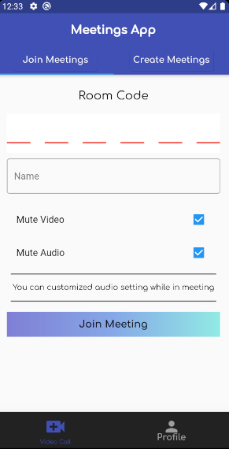
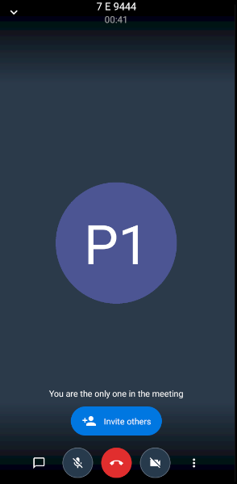

# Meetings App
A Flutter app through which you can do real time video conferencing.
Some Features are :-
- Supports login and registration using firebase.
- Create a meeting code
- Join meeting 
- Edit Username
- Additional features provided byt Jitsi Meet SDK

# Download
Download through this link :-

# Screenshots

# Requirements 
An Android device with Internet connection and a registered account.

# Note
This App is build using old Flutter Version if you are using Flutte 2.0 and above recommend update the libraries.

# Libraries Used
  - firebase_auth: 
  - cloud_firestore: 
  - firebase_core: 
  - flutter_gradient_colors: 
  - uuid: 
  - intl: 
  - introduction_screen: 
  - pin_code_fields:
  - flutter_custom_clippers: 
  - image_picker: 
  - jitsi_meet:
  - google_fonts: 
  
## Getting Started

This project is a starting point for a Flutter application.

A few resources to get you started if this is your first Flutter project:

- [Lab: Write your first Flutter app](https://flutter.dev/docs/get-started/codelab)
- [Cookbook: Useful Flutter samples](https://flutter.dev/docs/cookbook)

For help getting started with Flutter, view our
[online documentation](https://flutter.dev/docs), which offers tutorials,
samples, guidance on mobile development, and a full API reference.
